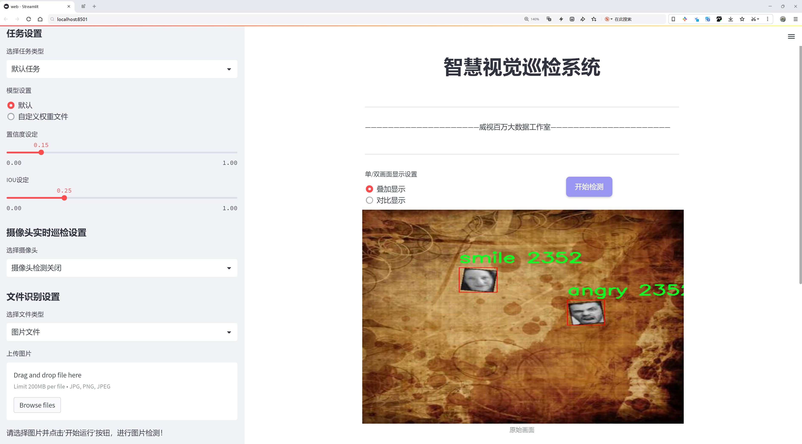
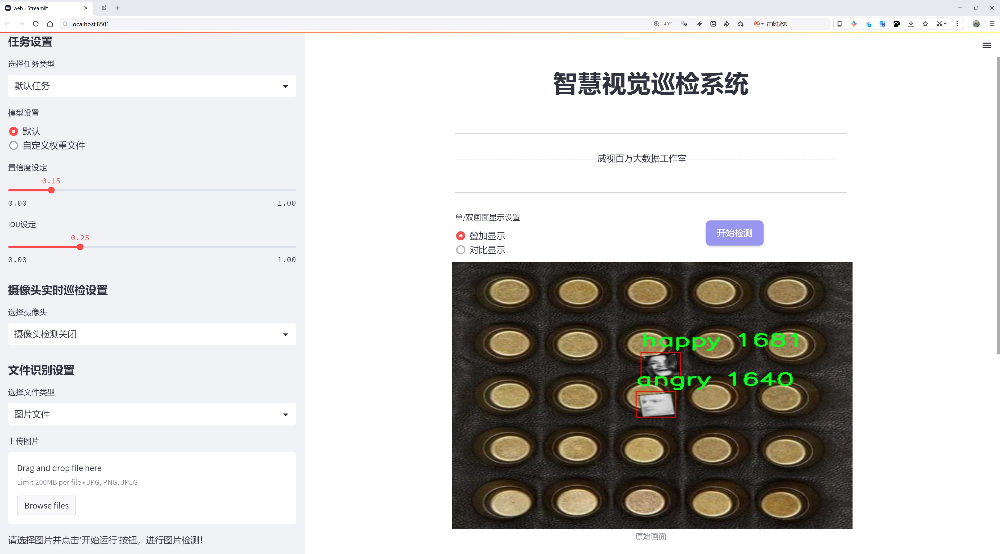
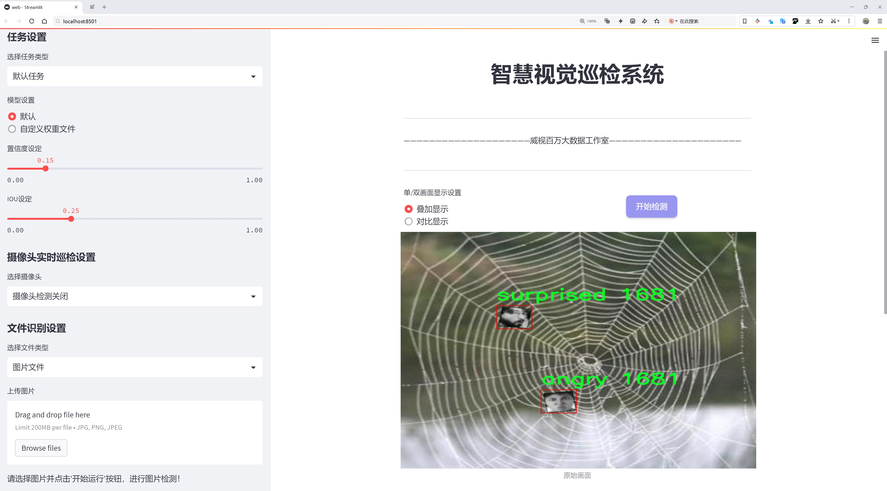
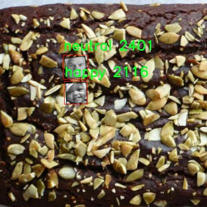
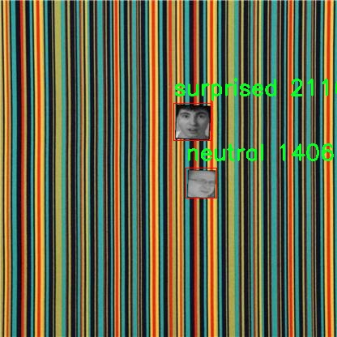
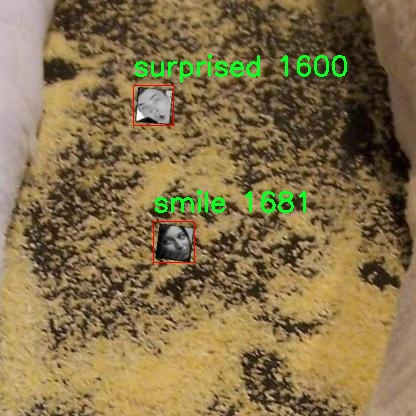
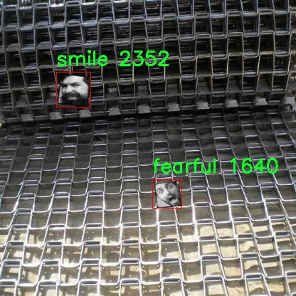
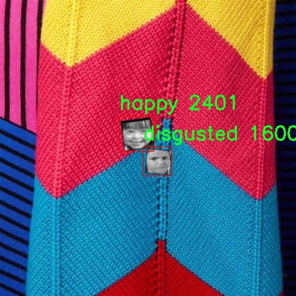

# 情感识别检测系统源码分享
 # [一条龙教学YOLOV8标注好的数据集一键训练_70+全套改进创新点发刊_Web前端展示]

### 1.研究背景与意义

项目参考[AAAI Association for the Advancement of Artificial Intelligence](https://gitee.com/qunshansj/projects)

项目来源[AACV Association for the Advancement of Computer Vision](https://gitee.com/qunmasj/projects)

研究背景与意义

随着人工智能技术的迅猛发展，情感识别作为计算机视觉和人机交互领域的重要研究方向，逐渐引起了学术界和工业界的广泛关注。情感识别不仅可以帮助机器理解人类的情感状态，还能够在智能客服、心理健康监测、社交机器人等应用中发挥重要作用。传统的情感识别方法多依赖于手工特征提取和简单的分类器，然而，这些方法在处理复杂场景和多样化情感表现时，往往面临着准确性不足和鲁棒性差的问题。

近年来，深度学习技术的兴起为情感识别提供了新的解决方案。YOLO（You Only Look Once）系列模型因其高效的实时目标检测能力而备受青睐。YOLOv8作为该系列的最新版本，进一步提升了模型的检测精度和速度，适用于多种视觉任务。基于YOLOv8的情感识别系统，能够通过对面部表情、姿态等信息的实时分析，实现对人类情感的准确识别。这种方法不仅提高了情感识别的效率，还为多模态情感分析提供了新的思路。

本研究将基于改进的YOLOv8模型，构建一个情感识别系统，旨在通过对大规模情感数据集的训练，提升情感识别的准确性和实用性。该数据集包含10000张图像，涵盖了8种情感类别：愤怒、厌恶、恐惧、快乐、中立、悲伤、微笑和惊讶。这些类别的多样性为模型的训练提供了丰富的样本，能够有效提升模型对不同情感状态的识别能力。此外，数据集中包含的图像数量和类别设置，能够帮助模型学习到更为细致的情感特征，进而提高情感识别的精度。

在实际应用中，情感识别系统可以为多种场景提供支持。例如，在智能客服系统中，能够根据用户的情感状态调整服务策略，提高用户满意度；在心理健康监测中，能够实时捕捉用户的情感变化，提供及时的干预措施；在社交机器人中，能够使机器人更好地理解和回应人类情感，增强人机交互的自然性和亲和力。因此，基于改进YOLOv8的情感识别系统不仅具有重要的学术价值，也具备广泛的应用前景。

综上所述，本研究的意义在于通过改进YOLOv8模型，提升情感识别的准确性和实时性，为相关领域的应用提供技术支持。同时，通过对大规模情感数据集的深入分析，探索情感识别中的关键特征和模型优化策略，为未来的研究提供理论基础和实践经验。这将为推动情感计算的发展、促进人机交互的智能化进程，具有重要的现实意义和深远的影响。

### 2.图片演示







##### 注意：由于此博客编辑较早，上面“2.图片演示”和“3.视频演示”展示的系统图片或者视频可能为老版本，新版本在老版本的基础上升级如下：（实际效果以升级的新版本为准）

  （1）适配了YOLOV8的“目标检测”模型和“实例分割”模型，通过加载相应的权重（.pt）文件即可自适应加载模型。

  （2）支持“图片识别”、“视频识别”、“摄像头实时识别”三种识别模式。

  （3）支持“图片识别”、“视频识别”、“摄像头实时识别”三种识别结果保存导出，解决手动导出（容易卡顿出现爆内存）存在的问题，识别完自动保存结果并导出到tempDir中。

  （4）支持Web前端系统中的标题、背景图等自定义修改，后面提供修改教程。

  另外本项目提供训练的数据集和训练教程,暂不提供权重文件（best.pt）,需要您按照教程进行训练后实现图片演示和Web前端界面演示的效果。

### 3.视频演示

[3.1 视频演示](https://www.bilibili.com/video/BV1C14SezEpb/)

### 4.数据集信息展示

##### 4.1 本项目数据集详细数据（类别数＆类别名）

nc: 8
names: ['angry', 'disgusted', 'fearful', 'happy', 'neutral', 'sad', 'smile', 'surprised']


##### 4.2 本项目数据集信息介绍

数据集信息展示

在本研究中，我们采用了名为“emotion”的数据集，以改进YOLOv8的情感识别系统。该数据集专注于情感识别任务，包含了多种情感类别，旨在为计算机视觉领域提供丰富的情感数据支持。具体而言，该数据集包含8个不同的情感类别，分别为：愤怒（angry）、厌恶（disgusted）、恐惧（fearful）、快乐（happy）、中性（neutral）、悲伤（sad）、微笑（smile）和惊讶（surprised）。这些类别涵盖了人类情感的广泛范围，使得模型能够更全面地理解和识别不同的情感状态。

“emotion”数据集的构建过程经过精心设计，确保了数据的多样性和代表性。每个情感类别均包含大量的图像样本，这些样本来源于不同的场景、光照条件和人群，以增强模型的泛化能力。通过这种方式，数据集不仅能有效地反映出人类情感的多样性，还能为YOLOv8模型的训练提供丰富的训练数据。这种多样性对于提高情感识别的准确性至关重要，因为情感的表达往往受到多种因素的影响，包括面部表情、身体语言和环境背景等。

在数据集的标注过程中，研究团队采用了严格的标注标准，确保每个图像的情感类别标注准确无误。通过对情感的细致分类，数据集为模型提供了清晰的学习目标，使得YOLOv8能够在训练过程中有效地捕捉到不同情感的特征。这种高质量的标注不仅提高了模型的学习效率，也为后续的模型评估提供了可靠的基准。

此外，为了增强模型的鲁棒性，数据集还考虑了不同年龄、性别和种族的样本分布，确保情感识别系统在多样化人群中的适用性。这一方面的考虑对于情感识别系统的实际应用尤为重要，因为情感的表达可能因文化和社会背景的不同而有所差异。通过在数据集中引入多样化的样本，研究团队希望构建一个能够在各种情境下表现良好的情感识别系统。

在模型训练阶段，数据集的划分也经过了精心设计，通常会将数据集分为训练集、验证集和测试集，以便对模型的性能进行全面评估。训练集用于模型的学习，验证集用于调整模型参数，而测试集则用于最终的性能评估。通过这种分割方式，研究团队能够有效地监控模型的学习过程，及时发现并纠正潜在的问题。

综上所述，“emotion”数据集为改进YOLOv8的情感识别系统提供了坚实的基础。其丰富的情感类别、多样化的样本和严格的标注标准，确保了模型在情感识别任务中的有效性和准确性。随着情感识别技术的不断发展，该数据集的应用将为相关研究提供重要的支持，推动情感计算领域的进一步探索与创新。











### 5.全套项目环境部署视频教程（零基础手把手教学）

[5.1 环境部署教程链接（零基础手把手教学）](https://www.ixigua.com/7404473917358506534?logTag=c807d0cbc21c0ef59de5)


[5.2 安装Python虚拟环境创建和依赖库安装视频教程链接（零基础手把手教学）](https://www.ixigua.com/7404474678003106304?logTag=1f1041108cd1f708b01a)

### 6.手把手YOLOV8训练视频教程（零基础小白有手就能学会）

[6.1 手把手YOLOV8训练视频教程（零基础小白有手就能学会）](https://www.ixigua.com/7404477157818401292?logTag=d31a2dfd1983c9668658)

### 7.70+种全套YOLOV8创新点代码加载调参视频教程（一键加载写好的改进模型的配置文件）

[7.1 70+种全套YOLOV8创新点代码加载调参视频教程（一键加载写好的改进模型的配置文件）](https://www.ixigua.com/7404478314661806627?logTag=29066f8288e3f4eea3a4)

### 8.70+种全套YOLOV8创新点原理讲解（非科班也可以轻松写刊发刊，V10版本正在科研待更新）

由于篇幅限制，每个创新点的具体原理讲解就不一一展开，具体见下列网址中的创新点对应子项目的技术原理博客网址【Blog】：


[8.1 70+种全套YOLOV8创新点原理讲解链接](https://gitee.com/qunmasj/good)

### 9.系统功能展示（检测对象为举例，实际内容以本项目数据集为准）

图9.1.系统支持检测结果表格显示

  图9.2.系统支持置信度和IOU阈值手动调节

  图9.3.系统支持自定义加载权重文件best.pt(需要你通过步骤5中训练获得)

  图9.4.系统支持摄像头实时识别

  图9.5.系统支持图片识别

  图9.6.系统支持视频识别

  图9.7.系统支持识别结果文件自动保存

  图9.8.系统支持Excel导出检测结果数据


### 10.原始YOLOV8算法原理

原始YOLOv8算法原理

YOLOv8作为YOLO系列模型的最新版本，代表了目标检测领域的前沿技术，其设计理念和实现方法在多个方面进行了创新和优化，旨在提升检测精度和速度。YOLOv8s模型的结构可以分为三个主要部分：Backbone、Neck和Head，这些部分共同协作，实现了高效的特征提取和目标检测。

在Backbone部分，YOLOv8s采用了CSPDarknet（Cross Stage Partial Darknet）结构，这是一个经过深度优化的特征提取网络。CSPDarknet的设计理念在于通过将网络分为两个部分，利用多个残差块来增强特征提取的能力。与前代模型YOLOv5相比，YOLOv8s引入了C2f模块，替代了原有的C3模块。C2f模块的创新在于将输入特征图分为两个分支，每个分支经过卷积层进行降维处理，这种结构的设计使得模型能够更有效地捕捉到特征信息。此外，C2f模块还将Bottleneck层替换为v8_C2fBottleneck层，进一步增强了特征图的维度和复杂性。这些分支的堆叠不仅提升了特征图的维度，也通过卷积层的融合，确保了梯度流的丰富性，从而提高了模型的学习能力。

在特征提取的效率方面，YOLOv8s引入了快速空间金字塔池化（SPPF）结构。该结构的设计旨在提取不同尺度的特征，并有效减少模型的参数量和计算量。这一改进使得YOLOv8s在处理多尺度目标时，能够保持高效的计算速度，同时不牺牲特征提取的质量。

Neck部分采用了特征金字塔网络（FPN）和路径聚合网络（PAN）的组合，这一结构通过多个卷积层和池化层对特征图进行处理和压缩。特征金字塔网络的引入，使得模型能够更好地处理不同层次的特征信息，从而在目标检测时，能够更精确地定位目标。通过这种多层次的特征处理，YOLOv8s能够在复杂场景中实现更高的检测准确度。

在Head部分，YOLOv8s的最大创新在于采用了无锚框（Anchor-Free）的检测方式。这一方法的核心在于直接预测目标的中心点和宽高比例，避免了传统锚框方法中需要手动设计和调整锚框的复杂性。这种设计不仅提高了检测速度，还在准确度上也有显著提升。通过去除Anchor框，YOLOv8s能够更灵活地适应不同类型的目标，尤其是在小目标检测和高分辨率图像处理方面表现出色。

YOLOv8还引入了一种新的损失函数，结合了分类分数和IOU的高次幂乘积，作为衡量任务对齐程度的指标。这一创新使得模型在训练过程中，能够更好地平衡分类和定位任务的损失，从而提高整体的检测性能。通过任务对齐学习（Task Alignment Learning），YOLOv8能够有效地区分正负样本，提高模型的收敛速度和预测精度。

在数据增强方面，YOLOv8在训练过程中停止使用Mosaic数据增强的最后10个epoch，以避免数据分布的失真。这一策略旨在提升模型的鲁棒性和泛化能力，使得YOLOv8在实际应用中能够更好地适应各种复杂场景。

综上所述，YOLOv8的设计不仅仅是对前代模型的简单迭代，而是通过引入一系列创新的结构和方法，全面提升了目标检测的性能。无论是在特征提取的效率、目标检测的准确度，还是在模型的灵活性和实时性方面，YOLOv8都展现出了其作为计算机视觉领域最先进模型的潜力。通过这些改进，YOLOv8不仅能够在各种硬件平台上高效运行，还能够在实际应用中实现更高的检测效果，为目标检测任务提供了强有力的支持。


### 11.项目核心源码讲解（再也不用担心看不懂代码逻辑）

#### 11.1 70+种YOLOv8算法改进源码大全和调试加载训练教程（非必要）\ultralytics\models\yolo\classify\val.py

以下是对代码中最核心部分的提取和详细中文注释：

```python
import torch
from ultralytics.data import ClassificationDataset, build_dataloader
from ultralytics.engine.validator import BaseValidator
from ultralytics.utils.metrics import ClassifyMetrics, ConfusionMatrix
from ultralytics.utils.plotting import plot_images

class ClassificationValidator(BaseValidator):
    """
    扩展自 BaseValidator 类的分类模型验证器。
    """

    def __init__(self, dataloader=None, save_dir=None, pbar=None, args=None, _callbacks=None):
        """初始化 ClassificationValidator 实例，设置数据加载器、保存目录、进度条和参数。"""
        super().__init__(dataloader, save_dir, pbar, args, _callbacks)
        self.targets = None  # 存储真实标签
        self.pred = None     # 存储预测结果
        self.args.task = 'classify'  # 设置任务类型为分类
        self.metrics = ClassifyMetrics()  # 初始化分类指标

    def init_metrics(self, model):
        """初始化混淆矩阵、类名及准确率指标。"""
        self.names = model.names  # 获取模型的类名
        self.nc = len(model.names)  # 类别数量
        self.confusion_matrix = ConfusionMatrix(nc=self.nc, conf=self.args.conf, task='classify')  # 初始化混淆矩阵
        self.pred = []  # 初始化预测结果列表
        self.targets = []  # 初始化真实标签列表

    def preprocess(self, batch):
        """预处理输入批次并返回处理后的批次。"""
        batch['img'] = batch['img'].to(self.device, non_blocking=True)  # 将图像移动到设备上
        batch['img'] = batch['img'].half() if self.args.half else batch['img'].float()  # 根据参数选择数据类型
        batch['cls'] = batch['cls'].to(self.device)  # 将类标签移动到设备上
        return batch

    def update_metrics(self, preds, batch):
        """使用模型预测和批次目标更新运行指标。"""
        n5 = min(len(self.names), 5)  # 取前5个预测结果
        self.pred.append(preds.argsort(1, descending=True)[:, :n5])  # 记录预测结果
        self.targets.append(batch['cls'])  # 记录真实标签

    def finalize_metrics(self, *args, **kwargs):
        """最终化模型的指标，如混淆矩阵和速度。"""
        self.confusion_matrix.process_cls_preds(self.pred, self.targets)  # 处理预测和真实标签以更新混淆矩阵
        self.metrics.speed = self.speed  # 记录速度
        self.metrics.confusion_matrix = self.confusion_matrix  # 保存混淆矩阵
        self.metrics.save_dir = self.save_dir  # 保存目录

    def get_stats(self):
        """返回通过处理目标和预测获得的指标字典。"""
        self.metrics.process(self.targets, self.pred)  # 处理真实标签和预测结果
        return self.metrics.results_dict  # 返回结果字典

    def build_dataset(self, img_path):
        """使用给定的图像路径和预处理参数创建并返回 ClassificationDataset 实例。"""
        return ClassificationDataset(root=img_path, args=self.args, augment=False, prefix=self.args.split)

    def get_dataloader(self, dataset_path, batch_size):
        """构建并返回分类任务的数据加载器。"""
        dataset = self.build_dataset(dataset_path)  # 创建数据集
        return build_dataloader(dataset, batch_size, self.args.workers, rank=-1)  # 返回数据加载器

    def print_results(self):
        """打印 YOLO 目标检测模型的评估指标。"""
        pf = '%22s' + '%11.3g' * len(self.metrics.keys)  # 打印格式
        LOGGER.info(pf % ('all', self.metrics.top1, self.metrics.top5))  # 打印 top1 和 top5 准确率

    def plot_val_samples(self, batch, ni):
        """绘制验证图像样本。"""
        plot_images(
            images=batch['img'],
            batch_idx=torch.arange(len(batch['img'])),
            cls=batch['cls'].view(-1),  # 使用 .view() 处理类标签
            fname=self.save_dir / f'val_batch{ni}_labels.jpg',
            names=self.names,
            on_plot=self.on_plot)

    def plot_predictions(self, batch, preds, ni):
        """在输入图像上绘制预测结果并保存结果。"""
        plot_images(batch['img'],
                    batch_idx=torch.arange(len(batch['img'])),
                    cls=torch.argmax(preds, dim=1),  # 获取预测的类别
                    fname=self.save_dir / f'val_batch{ni}_pred.jpg',
                    names=self.names,
                    on_plot=self.on_plot)  # 绘制预测结果
```

### 核心部分分析
1. **类的初始化**：`__init__` 方法初始化了验证器的基本参数，包括数据加载器、保存目录、进度条和任务类型。
2. **指标初始化**：`init_metrics` 方法用于初始化混淆矩阵和类别名称，以便后续计算准确率等指标。
3. **数据预处理**：`preprocess` 方法负责将输入数据转换为适合模型处理的格式。
4. **指标更新**：`update_metrics` 方法在每个批次后更新预测结果和真实标签。
5. **最终化指标**：`finalize_metrics` 方法处理所有的预测和真实标签，更新混淆矩阵和速度等信息。
6. **统计结果**：`get_stats` 方法返回经过处理的指标结果，方便后续分析。
7. **数据集和数据加载器构建**：`build_dataset` 和 `get_dataloader` 方法负责创建数据集和数据加载器，便于模型训练和验证。
8. **结果打印和绘图**：`print_results`、`plot_val_samples` 和 `plot_predictions` 方法用于输出模型评估结果和可视化验证样本及预测结果。

这个文件是Ultralytics YOLO框架中的一个分类验证器（ClassificationValidator），用于对分类模型进行验证。它继承自基础验证器（BaseValidator），并提供了一系列方法来处理分类任务的验证过程。

首先，文件导入了必要的库，包括PyTorch和Ultralytics库中的多个模块。这些模块提供了数据集构建、数据加载、验证器基类、日志记录、分类指标和绘图功能。

在`ClassificationValidator`类中，构造函数初始化了一些实例变量，包括目标（targets）、预测（pred）、任务类型（task）以及分类指标（metrics）。它还调用了父类的构造函数，以便继承基本的验证器功能。

`get_desc`方法返回一个格式化的字符串，概述了分类指标，包括类别名称、Top-1准确率和Top-5准确率。

`init_metrics`方法用于初始化混淆矩阵、类别名称和准确率。它接收一个模型作为参数，并根据模型的类别名称设置相关属性。

`preprocess`方法负责对输入批次进行预处理，包括将图像和类别标签移动到指定的设备（如GPU），并根据需要转换数据类型（半精度或单精度）。

`update_metrics`方法用于更新运行中的指标，接收模型的预测结果和批次目标，并将它们存储在类的属性中。

`finalize_metrics`方法在验证结束时被调用，用于处理混淆矩阵并生成最终的指标。如果设置了绘图选项，它还会绘制混淆矩阵。

`get_stats`方法返回一个字典，包含通过处理目标和预测结果获得的指标。

`build_dataset`方法根据给定的图像路径和预处理参数创建并返回一个分类数据集实例。

`get_dataloader`方法构建并返回一个数据加载器，以便在分类任务中使用。

`print_results`方法用于打印YOLO模型的评估指标，包括Top-1和Top-5准确率。

`plot_val_samples`和`plot_predictions`方法用于绘制验证图像样本和预测结果，并将其保存为图像文件。这些方法使用了`plot_images`函数，能够将图像和类别标签或预测结果可视化。

总的来说，这个文件实现了一个完整的分类验证流程，包括数据加载、预处理、指标计算和结果可视化，为YOLO模型的分类任务提供了支持。

#### 11.2 70+种YOLOv8算法改进源码大全和调试加载训练教程（非必要）\ultralytics\models\yolo\pose\train.py

以下是代码中最核心的部分，并附上详细的中文注释：

```python
# 导入必要的库和模块
from copy import copy
from ultralytics.models import yolo
from ultralytics.nn.tasks import PoseModel
from ultralytics.utils import DEFAULT_CFG, LOGGER
from ultralytics.utils.plotting import plot_images, plot_results

class PoseTrainer(yolo.detect.DetectionTrainer):
    """
    PoseTrainer类扩展了DetectionTrainer类，用于基于姿态模型的训练。
    """

    def __init__(self, cfg=DEFAULT_CFG, overrides=None, _callbacks=None):
        """初始化PoseTrainer对象，使用指定的配置和覆盖参数。"""
        if overrides is None:
            overrides = {}
        overrides['task'] = 'pose'  # 设置任务类型为姿态估计
        super().__init__(cfg, overrides, _callbacks)  # 调用父类构造函数

        # 针对Apple MPS设备的警告
        if isinstance(self.args.device, str) and self.args.device.lower() == 'mps':
            LOGGER.warning("WARNING ⚠️ Apple MPS known Pose bug. Recommend 'device=cpu' for Pose models. "
                           'See https://github.com/ultralytics/ultralytics/issues/4031.')

    def get_model(self, cfg=None, weights=None, verbose=True):
        """获取指定配置和权重的姿态估计模型。"""
        # 创建PoseModel实例
        model = PoseModel(cfg, ch=3, nc=self.data['nc'], data_kpt_shape=self.data['kpt_shape'], verbose=verbose)
        if weights:
            model.load(weights)  # 加载权重

        return model  # 返回模型

    def set_model_attributes(self):
        """设置PoseModel的关键点形状属性。"""
        super().set_model_attributes()  # 调用父类方法
        self.model.kpt_shape = self.data['kpt_shape']  # 设置关键点形状

    def get_validator(self):
        """返回PoseValidator类的实例，用于验证。"""
        self.loss_names = 'box_loss', 'pose_loss', 'kobj_loss', 'cls_loss', 'dfl_loss'  # 定义损失名称
        return yolo.pose.PoseValidator(self.test_loader, save_dir=self.save_dir, args=copy(self.args))  # 返回验证器实例

    def plot_training_samples(self, batch, ni):
        """绘制一批训练样本，包括标注的类别标签、边界框和关键点。"""
        images = batch['img']  # 获取图像
        kpts = batch['keypoints']  # 获取关键点
        cls = batch['cls'].squeeze(-1)  # 获取类别
        bboxes = batch['bboxes']  # 获取边界框
        paths = batch['im_file']  # 获取图像文件路径
        batch_idx = batch['batch_idx']  # 获取批次索引
        # 绘制图像并保存
        plot_images(images,
                    batch_idx,
                    cls,
                    bboxes,
                    kpts=kpts,
                    paths=paths,
                    fname=self.save_dir / f'train_batch{ni}.jpg',
                    on_plot=self.on_plot)

    def plot_metrics(self):
        """绘制训练和验证的指标。"""
        plot_results(file=self.csv, pose=True, on_plot=self.on_plot)  # 保存结果图像
```

### 代码核心部分说明：
1. **PoseTrainer类**：该类用于训练姿态估计模型，继承自YOLO的检测训练器。
2. **初始化方法**：设置任务类型为姿态估计，并处理设备警告。
3. **获取模型**：创建并返回姿态估计模型，支持加载预训练权重。
4. **设置模型属性**：设置模型的关键点形状属性。
5. **获取验证器**：返回用于验证的PoseValidator实例。
6. **绘制训练样本**：将训练样本可视化，包括图像、关键点和边界框。
7. **绘制指标**：绘制训练和验证过程中的指标，便于分析模型性能。

这个程序文件是一个用于训练基于姿态估计模型的YOLOv8算法的实现，文件名为`train.py`，它继承自Ultralytics库中的`DetectionTrainer`类，专门用于处理姿态识别任务。

首先，文件导入了一些必要的模块和类，包括YOLO模型、PoseModel、日志记录器和绘图工具。PoseTrainer类的定义扩展了DetectionTrainer类，专注于姿态模型的训练。该类的构造函数`__init__`接受配置参数和覆盖参数，并在初始化时设置任务类型为“pose”。如果设备类型为“mps”，则会发出警告，建议使用“cpu”进行训练，因为在Apple MPS上存在已知的姿态模型问题。

`get_model`方法用于获取姿态估计模型，接受配置和权重参数。如果提供了权重，则会加载这些权重。`set_model_attributes`方法设置了PoseModel的关键点形状属性，确保模型能够正确处理输入数据。

`get_validator`方法返回一个PoseValidator类的实例，用于验证模型的性能。它定义了损失名称，包括边界框损失、姿态损失、关键对象损失、类别损失和分布式焦点损失。

`plot_training_samples`方法用于绘制一批训练样本，显示带有注释的类标签、边界框和关键点。它从输入批次中提取图像、关键点、类别和边界框，并使用`plot_images`函数将这些信息可视化，保存为图像文件。

最后，`plot_metrics`方法用于绘制训练和验证的指标，调用`plot_results`函数生成结果图像，便于分析模型的训练过程。

整体来看，这个文件实现了一个完整的姿态模型训练流程，包括模型初始化、训练样本绘制和训练指标可视化，适合用于YOLOv8姿态估计任务的开发和调试。

#### 11.3 ui.py

以下是保留的核心代码部分，并添加了详细的中文注释：

```python
import sys
import subprocess

def run_script(script_path):
    """
    使用当前 Python 环境运行指定的脚本。

    Args:
        script_path (str): 要运行的脚本路径

    Returns:
        None
    """
    # 获取当前 Python 解释器的路径
    python_path = sys.executable

    # 构建运行命令，使用 streamlit 运行指定的脚本
    command = f'"{python_path}" -m streamlit run "{script_path}"'

    # 执行命令，并等待其完成
    result = subprocess.run(command, shell=True)
    
    # 检查命令执行结果，如果返回码不为0，表示出错
    if result.returncode != 0:
        print("脚本运行出错。")

# 实例化并运行应用
if __name__ == "__main__":
    # 指定要运行的脚本路径
    script_path = "web.py"  # 假设脚本在当前目录下

    # 调用函数运行脚本
    run_script(script_path)
```

### 代码说明：
1. **导入模块**：
   - `sys`：用于获取当前 Python 解释器的路径。
   - `subprocess`：用于执行外部命令。

2. **定义 `run_script` 函数**：
   - 该函数接收一个脚本路径作为参数，并使用当前 Python 环境运行该脚本。
   - 通过 `sys.executable` 获取当前 Python 解释器的路径。
   - 构建命令字符串，使用 `streamlit` 运行指定的脚本。
   - 使用 `subprocess.run` 执行命令，并检查返回码以判断脚本是否成功运行。

3. **主程序块**：
   - 在主程序中，指定要运行的脚本路径（此处假设为 `web.py`）。
   - 调用 `run_script` 函数来执行该脚本。

这个程序文件名为 `ui.py`，主要功能是通过当前的 Python 环境来运行一个指定的脚本。程序首先导入了必要的模块，包括 `sys`、`os` 和 `subprocess`，以及一个自定义的 `abs_path` 函数，用于获取文件的绝对路径。

在 `run_script` 函数中，程序接受一个参数 `script_path`，这是要运行的脚本的路径。函数首先获取当前 Python 解释器的路径，存储在 `python_path` 变量中。接着，构建一个命令字符串，该命令使用 `streamlit` 模块来运行指定的脚本。这个命令的格式是 `"{python_path}" -m streamlit run "{script_path}"`，其中 `"{python_path}"` 和 `"{script_path}"` 会被实际的路径替换。

然后，程序使用 `subprocess.run` 方法来执行这个命令，`shell=True` 参数允许在 shell 中执行命令。执行后，程序检查返回的结果码，如果不为零，表示脚本运行出错，程序会打印出相应的错误信息。

在文件的最后部分，程序通过 `if __name__ == "__main__":` 语句来确保只有在直接运行该文件时才会执行后面的代码。在这里，程序指定了要运行的脚本路径 `web.py`，并调用 `run_script` 函数来执行这个脚本。

总体来说，这个程序的目的是为用户提供一个简单的接口，以便在当前 Python 环境中运行一个 Streamlit 应用脚本。

#### 11.4 train.py

以下是经过简化并添加详细中文注释的核心代码部分：

```python
import random
import numpy as np
import torch.nn as nn
from ultralytics.data import build_dataloader, build_yolo_dataset
from ultralytics.engine.trainer import BaseTrainer
from ultralytics.models import yolo
from ultralytics.nn.tasks import DetectionModel
from ultralytics.utils import LOGGER, RANK
from ultralytics.utils.torch_utils import de_parallel, torch_distributed_zero_first

class DetectionTrainer(BaseTrainer):
    """
    基于检测模型的训练类，继承自BaseTrainer类。
    """

    def build_dataset(self, img_path, mode="train", batch=None):
        """
        构建YOLO数据集。

        参数:
            img_path (str): 包含图像的文件夹路径。
            mode (str): 模式，'train'表示训练模式，'val'表示验证模式。
            batch (int, optional): 批次大小，仅用于'rect'模式。默认为None。
        """
        gs = max(int(de_parallel(self.model).stride.max() if self.model else 0), 32)  # 获取模型的最大步幅
        return build_yolo_dataset(self.args, img_path, batch, self.data, mode=mode, rect=mode == "val", stride=gs)

    def get_dataloader(self, dataset_path, batch_size=16, rank=0, mode="train"):
        """构造并返回数据加载器。"""
        assert mode in ["train", "val"]  # 确保模式合法
        with torch_distributed_zero_first(rank):  # 仅在DDP情况下初始化数据集
            dataset = self.build_dataset(dataset_path, mode, batch_size)  # 构建数据集
        shuffle = mode == "train"  # 训练模式下打乱数据
        workers = self.args.workers if mode == "train" else self.args.workers * 2  # 根据模式设置工作线程数
        return build_dataloader(dataset, batch_size, workers, shuffle, rank)  # 返回数据加载器

    def preprocess_batch(self, batch):
        """对图像批次进行预处理，包括缩放和转换为浮点数。"""
        batch["img"] = batch["img"].to(self.device, non_blocking=True).float() / 255  # 将图像转换为浮点数并归一化
        if self.args.multi_scale:  # 如果启用多尺度
            imgs = batch["img"]
            sz = (
                random.randrange(self.args.imgsz * 0.5, self.args.imgsz * 1.5 + self.stride)
                // self.stride
                * self.stride
            )  # 随机选择一个新的尺寸
            sf = sz / max(imgs.shape[2:])  # 计算缩放因子
            if sf != 1:
                ns = [
                    math.ceil(x * sf / self.stride) * self.stride for x in imgs.shape[2:]
                ]  # 计算新的形状
                imgs = nn.functional.interpolate(imgs, size=ns, mode="bilinear", align_corners=False)  # 调整图像大小
            batch["img"] = imgs  # 更新批次图像
        return batch

    def get_model(self, cfg=None, weights=None, verbose=True):
        """返回YOLO检测模型。"""
        model = DetectionModel(cfg, nc=self.data["nc"], verbose=verbose and RANK == -1)  # 创建检测模型
        if weights:
            model.load(weights)  # 加载权重
        return model

    def plot_training_samples(self, batch, ni):
        """绘制带有注释的训练样本。"""
        plot_images(
            images=batch["img"],
            batch_idx=batch["batch_idx"],
            cls=batch["cls"].squeeze(-1),
            bboxes=batch["bboxes"],
            paths=batch["im_file"],
            fname=self.save_dir / f"train_batch{ni}.jpg",
            on_plot=self.on_plot,
        )

    def plot_metrics(self):
        """从CSV文件中绘制指标。"""
        plot_results(file=self.csv, on_plot=self.on_plot)  # 保存结果图像
```

### 代码说明
1. **DetectionTrainer类**：这是一个用于训练YOLO检测模型的类，继承自`BaseTrainer`，包含了数据集构建、数据加载、图像预处理、模型获取和绘图等功能。
2. **build_dataset方法**：用于构建YOLO数据集，支持训练和验证模式，允许用户自定义数据增强。
3. **get_dataloader方法**：构造数据加载器，确保在分布式训练时只初始化一次数据集，并根据模式设置数据打乱和工作线程数。
4. **preprocess_batch方法**：对图像批次进行预处理，包括归一化和可选的多尺度调整。
5. **get_model方法**：返回一个YOLO检测模型，可以选择加载预训练权重。
6. **plot_training_samples和plot_metrics方法**：用于可视化训练样本和训练过程中的指标，便于监控训练效果。

这个程序文件 `train.py` 是一个用于训练目标检测模型的脚本，基于 Ultralytics YOLO 框架。文件中定义了一个名为 `DetectionTrainer` 的类，该类继承自 `BaseTrainer`，专门用于处理目标检测任务。

在这个类中，首先导入了一些必要的库和模块，包括数学运算、随机数生成、深度学习相关的库（如 PyTorch）以及 Ultralytics YOLO 的一些功能模块。接着，类的文档字符串提供了一个使用示例，展示了如何创建 `DetectionTrainer` 的实例并调用 `train` 方法进行训练。

`DetectionTrainer` 类包含多个方法。`build_dataset` 方法用于构建 YOLO 数据集，接收图像路径、模式（训练或验证）和批次大小作为参数。它会根据模型的步幅计算出合适的大小，并调用 `build_yolo_dataset` 函数来生成数据集。

`get_dataloader` 方法则负责构建并返回数据加载器。它根据模式选择是否打乱数据，并在分布式训练的情况下，确保数据集只初始化一次。`preprocess_batch` 方法用于对图像批次进行预处理，包括缩放和转换为浮点数格式。

`set_model_attributes` 方法用于设置模型的属性，包括类别数量和类别名称等。`get_model` 方法返回一个 YOLO 检测模型实例，并可选择加载预训练权重。

`get_validator` 方法返回一个用于模型验证的 `DetectionValidator` 实例，负责计算损失值。`label_loss_items` 方法用于返回带有标签的训练损失项字典，以便于监控训练过程中的损失情况。

`progress_string` 方法生成一个格式化的字符串，显示训练进度，包括当前的轮次、GPU 内存使用情况、损失值、实例数量和图像大小等信息。`plot_training_samples` 方法用于绘制训练样本及其标注，便于可视化训练数据的质量。

最后，`plot_metrics` 和 `plot_training_labels` 方法分别用于绘制训练过程中的指标和创建带标签的训练图，以便于分析模型的训练效果。

总体来说，这个文件提供了一个完整的训练框架，涵盖了数据集构建、数据加载、模型训练、损失计算和结果可视化等多个方面，适用于目标检测任务的训练。

#### 11.5 code\ultralytics\utils\ops.py

以下是经过简化并添加详细中文注释的核心代码部分：

```python
import torch
import numpy as np
import torchvision

def non_max_suppression(
    prediction,
    conf_thres=0.25,
    iou_thres=0.45,
    classes=None,
    max_det=300,
):
    """
    执行非最大抑制（NMS）以过滤重叠的边界框。

    参数:
        prediction (torch.Tensor): 预测结果，形状为 (batch_size, num_classes + 4, num_boxes)
        conf_thres (float): 置信度阈值，低于该值的框将被过滤。
        iou_thres (float): IoU阈值，低于该值的框将被过滤。
        classes (List[int]): 需要考虑的类别索引列表。如果为None，则考虑所有类别。
        max_det (int): NMS后保留的最大框数。

    返回:
        (List[torch.Tensor]): 每个图像的保留框的列表，形状为 (num_boxes, 6)。
    """
    # 检查置信度和IoU阈值
    assert 0 <= conf_thres <= 1, f"无效的置信度阈值 {conf_thres}"
    assert 0 <= iou_thres <= 1, f"无效的IoU阈值 {iou_thres}"

    bs = prediction.shape[0]  # 批量大小
    nc = prediction.shape[1] - 4  # 类别数量
    xc = prediction[:, 4:5].amax(1) > conf_thres  # 置信度大于阈值的候选框

    output = [torch.zeros((0, 6), device=prediction.device)] * bs  # 初始化输出

    for xi, x in enumerate(prediction):  # 遍历每个图像的预测结果
        x = x[xc[xi]]  # 过滤掉低置信度的框
        if not x.shape[0]:  # 如果没有框，继续下一个图像
            continue

        # 提取边界框和类别
        box, cls = x[:, :4], x[:, 5:]  # box: (x1, y1, x2, y2), cls: 类别
        conf, j = cls.max(1, keepdim=True)  # 选择置信度最高的类别
        x = torch.cat((box, conf, j.float()), 1)[conf.view(-1) > conf_thres]  # 过滤低置信度框

        # 按类别过滤
        if classes is not None:
            x = x[(x[:, 5:6] == torch.tensor(classes, device=x.device)).any(1)]

        n = x.shape[0]  # 当前图像的框数量
        if not n:  # 如果没有框，继续下一个图像
            continue

        # 执行NMS
        boxes = x[:, :4]  # 边界框
        scores = x[:, 4]  # 置信度
        i = torchvision.ops.nms(boxes, scores, iou_thres)  # 使用torchvision的NMS
        i = i[:max_det]  # 限制检测框数量

        output[xi] = x[i]  # 保存结果

    return output  # 返回每个图像的保留框
```

### 代码注释说明：
1. **导入必要的库**：导入了`torch`和`numpy`，以及`torchvision`用于后续的NMS操作。
2. **函数定义**：`non_max_suppression`函数用于执行非最大抑制，减少重叠的边界框。
3. **参数说明**：详细说明了函数的输入参数及其含义。
4. **置信度和IoU检查**：确保输入的阈值在有效范围内。
5. **初始化输出**：为每个图像初始化一个空的输出列表。
6. **遍历每个图像的预测结果**：对每个图像的预测结果进行处理，过滤低置信度的框。
7. **提取边界框和类别**：将边界框和类别信息分开。
8. **执行NMS**：使用`torchvision`的NMS函数进行处理，并限制返回的框数量。
9. **返回结果**：最终返回每个图像的保留框。

以上代码是YOLO模型后处理中的核心部分，负责对预测结果进行非最大抑制，确保最终输出的边界框是最优的。

这个程序文件是一个与Ultralytics YOLO（You Only Look Once）模型相关的工具模块，主要包含了一些图像处理和边界框操作的函数。代码中定义了多个函数和一个上下文管理器类，用于性能分析。

首先，`Profile`类是一个用于性能分析的上下文管理器，能够记录代码块的执行时间。它可以通过`with Profile():`语句使用，也可以作为装饰器使用。初始化时可以指定初始时间和设备（如CPU或GPU），在进入上下文时开始计时，退出时停止计时并计算经过的时间。

接下来，`segment2box`函数将分割标签转换为边界框标签，确保框的坐标在图像内部。它接收一个分割标签（通常是一个点的集合）并返回最小和最大x、y值的数组，表示边界框的坐标。

`scale_boxes`函数用于根据原始图像和目标图像的尺寸调整边界框的大小。它支持不同的填充和坐标格式，并确保边界框在目标图像内。

`make_divisible`函数用于将一个数字调整为最接近的可被指定除数整除的数，这在处理图像时可能用于确保尺寸的兼容性。

`nms_rotated`和`non_max_suppression`函数实现了非极大值抑制（NMS），用于从多个候选框中选择最优框。`nms_rotated`专门处理旋转边界框，而`non_max_suppression`则处理标准的边界框，支持多标签和类过滤。

`clip_boxes`和`clip_coords`函数用于将边界框和坐标限制在图像边界内，确保不会超出图像的范围。

`scale_image`函数将掩码调整为原始图像的大小，`xyxy2xywh`和`xywh2xyxy`等函数则用于在不同的边界框格式之间进行转换，例如从左上角和右下角坐标格式转换为中心点和宽高格式。

`masks2segments`函数将掩码转换为分割线段，支持选择最大的分割或连接所有分割。`convert_torch2numpy_batch`函数用于将PyTorch张量批量转换为NumPy数组，方便后续处理。

最后，`clean_str`函数用于清理字符串，替换特殊字符为下划线，便于在文件名或其他需要干净字符串的地方使用。

总体而言，这个模块提供了YOLO模型在图像处理、边界框调整和性能分析等方面所需的多种工具函数，旨在简化模型的使用和提高处理效率。

#### 11.6 70+种YOLOv8算法改进源码大全和调试加载训练教程（非必要）\ultralytics\hub\auth.py

以下是代码中最核心的部分，并附上详细的中文注释：

```python
import requests  # 导入请求库，用于发送HTTP请求

# 定义一些常量，用于API的根地址
from ultralytics.hub.utils import HUB_API_ROOT, request_with_credentials
from ultralytics.utils import SETTINGS, is_colab

class Auth:
    """
    处理身份验证过程，包括API密钥处理、基于cookie的身份验证和头部生成。

    支持的身份验证方法：
    1. 直接使用API密钥。
    2. 使用浏览器cookie进行身份验证（特别是在Google Colab中）。
    3. 提示用户输入API密钥。
    """
    id_token = api_key = False  # 初始化id_token和api_key为False

    def __init__(self, api_key='', verbose=False):
        """
        初始化Auth类，可以选择性地传入API密钥。

        参数：
            api_key (str, optional): 可能是API密钥或组合的API密钥和模型ID
        """
        # 如果api_key包含组合的key_model，只保留API密钥部分
        api_key = api_key.split('_')[0]

        # 设置API密钥属性，如果没有传入则使用设置中的API密钥
        self.api_key = api_key or SETTINGS.get('api_key', '')

        # 如果提供了API密钥
        if self.api_key:
            # 检查提供的API密钥是否与设置中的API密钥匹配
            if self.api_key == SETTINGS.get('api_key'):
                # 如果匹配，记录用户已登录
                if verbose:
                    print('Authenticated ✅')  # 使用print替代LOGGER以简化示例
                return
            else:
                # 尝试使用提供的API密钥进行身份验证
                success = self.authenticate()
        # 如果没有提供API密钥且环境是Google Colab
        elif is_colab():
            # 尝试使用浏览器cookie进行身份验证
            success = self.auth_with_cookies()
        else:
            # 请求用户输入API密钥
            success = self.request_api_key()

        # 如果身份验证成功，更新设置中的API密钥
        if success:
            SETTINGS.update({'api_key': self.api_key})
            if verbose:
                print('New authentication successful ✅')
        elif verbose:
            print(f'Retrieve API key from {API_KEY_URL}')

    def authenticate(self) -> bool:
        """
        尝试使用id_token或API密钥进行身份验证。

        返回：
            bool: 如果身份验证成功则返回True，否则返回False。
        """
        try:
            header = self.get_auth_header()  # 获取身份验证头
            if header:
                # 发送POST请求进行身份验证
                r = requests.post(f'{HUB_API_ROOT}/v1/auth', headers=header)
                if not r.json().get('success', False):
                    raise ConnectionError('Unable to authenticate.')
                return True
            raise ConnectionError('User has not authenticated locally.')
        except ConnectionError:
            self.id_token = self.api_key = False  # 重置无效的token
            print('Invalid API key ⚠️')  # 使用print替代LOGGER以简化示例
            return False

    def auth_with_cookies(self) -> bool:
        """
        尝试通过cookie获取身份验证并设置id_token。用户必须已登录HUB并在支持的浏览器中运行。

        返回：
            bool: 如果身份验证成功则返回True，否则返回False。
        """
        if not is_colab():
            return False  # 目前仅在Colab中有效
        try:
            authn = request_with_credentials(f'{HUB_API_ROOT}/v1/auth/auto')  # 获取自动身份验证
            if authn.get('success', False):
                self.id_token = authn.get('data', {}).get('idToken', None)
                self.authenticate()  # 进行身份验证
                return True
            raise ConnectionError('Unable to fetch browser authentication details.')
        except ConnectionError:
            self.id_token = False  # 重置无效的token
            return False

    def get_auth_header(self):
        """
        获取用于API请求的身份验证头。

        返回：
            (dict): 如果设置了id_token或API密钥，则返回身份验证头，否则返回None。
        """
        if self.id_token:
            return {'authorization': f'Bearer {self.id_token}'}
        elif self.api_key:
            return {'x-api-key': self.api_key}
        return None  # 否则返回None
```

### 代码核心部分解释：
1. **类Auth**：用于处理身份验证，包括API密钥和cookie的管理。
2. **初始化方法**：根据传入的API密钥或环境（如Colab）进行身份验证。
3. **authenticate方法**：尝试使用API密钥或id_token进行身份验证，并返回结果。
4. **auth_with_cookies方法**：在Colab环境中使用cookie进行身份验证。
5. **get_auth_header方法**：生成身份验证请求所需的头部信息。

这个程序文件是一个用于管理身份验证的类，名为 `Auth`，主要用于与 Ultralytics YOLO 的 API 进行交互。它支持多种身份验证方式，包括直接使用 API 密钥、使用浏览器 cookies 进行身份验证（特别是在 Google Colab 环境中），以及提示用户输入 API 密钥。

在类的属性中，`id_token`、`api_key` 和 `model_key` 都被初始化为 `False`，其中 `id_token` 用于身份验证，`api_key` 是用于身份验证的 API 密钥，而 `model_key` 是一个占位符，初始值为 `False`。

在初始化方法 `__init__` 中，可以选择性地传入一个 API 密钥。如果传入的 API 密钥包含模型 ID，程序会将其分割，只保留 API 密钥部分。接着，程序会检查是否提供了 API 密钥。如果提供了，它会与设置中的 API 密钥进行比较，如果匹配则表示用户已经登录。如果不匹配，则尝试使用提供的 API 密钥进行身份验证。如果没有提供 API 密钥，并且当前环境是 Google Colab，程序会尝试使用浏览器 cookies 进行身份验证。如果都不满足，则会请求用户输入 API 密钥。

`request_api_key` 方法用于提示用户输入 API 密钥，最多允许三次尝试。如果成功认证，则返回 `True`，否则抛出连接错误。

`authenticate` 方法尝试使用 `id_token` 或 API 密钥与服务器进行身份验证。如果身份验证成功，返回 `True`，否则返回 `False`，并重置无效的 `id_token` 和 `api_key`。

`auth_with_cookies` 方法尝试通过 cookies 获取身份验证信息，用户必须已经登录到 HUB，并在支持的浏览器中运行。如果成功获取身份验证信息，则调用 `authenticate` 方法进行验证。

`get_auth_header` 方法用于生成 API 请求的身份验证头。如果设置了 `id_token`，则返回包含 Bearer 令牌的头部；如果设置了 API 密钥，则返回包含 API 密钥的头部；如果都没有设置，则返回 `None`。

整体来看，这个类的设计旨在简化与 Ultralytics YOLO API 的身份验证过程，确保用户能够方便地进行身份验证并安全地访问 API。

### 12.系统整体结构（节选）

### 整体功能和构架概括

该项目是一个基于Ultralytics YOLOv8框架的目标检测和姿态估计模型的实现，提供了多种功能模块，支持模型的训练、验证、推理和身份验证。整体架构设计旨在简化用户的使用体验，提供灵活的配置选项和可扩展性。项目中的文件结构清晰，各个模块的功能分明，便于用户进行模型训练、验证和推理，同时支持与Ultralytics Hub的身份验证和交互。

主要功能模块包括：
- **模型训练**：提供了针对目标检测和姿态估计的训练脚本。
- **模型验证**：实现了验证器，用于评估模型的性能。
- **图像处理**：包含了一系列工具函数，用于图像和边界框的处理。
- **身份验证**：管理与Ultralytics Hub的身份验证过程。
- **用户界面**：提供了简单的用户界面功能，便于运行特定的脚本。

### 文件功能整理表

| 文件路径                                                                                       | 功能描述                                                         |
|------------------------------------------------------------------------------------------------|------------------------------------------------------------------|
| `ultralytics/models/yolo/classify/val.py`                                                    | 实现分类模型的验证流程，包括数据加载、指标计算和结果可视化。   |
| `ultralytics/models/yolo/pose/train.py`                                                      | 实现姿态估计模型的训练流程，包括数据集构建、模型训练和结果绘制。 |
| `ui.py`                                                                                       | 提供一个简单的接口，用于在当前Python环境中运行Streamlit应用脚本。 |
| `train.py`                                                                                    | 实现目标检测模型的训练流程，包括数据集构建、模型训练和损失监控。 |
| `code/ultralytics/utils/ops.py`                                                               | 提供图像处理和边界框操作的工具函数，包括NMS、坐标转换等。       |
| `ultralytics/hub/auth.py`                                                                    | 管理与Ultralytics Hub的身份验证，包括API密钥和cookie验证。      |
| `ultralytics/utils/callbacks/clearml.py`                                                    | 集成ClearML用于实验管理和监控的回调函数。                       |
| `code/ultralytics/utils/checks.py`                                                           | 提供检查和验证功能，确保模型和数据的完整性和正确性。           |
| `code/ultralytics/models/yolo/detect/predict.py`                                            | 实现目标检测模型的推理流程，包括加载模型和处理输入图像。       |
| `ultralytics/nn/backbone/revcol.py`                                                          | 定义YOLOv8模型的反卷积网络结构。                                |
| `ultralytics/nn/extra_modules/kernel_warehouse.py`                                           | 提供额外的模块和功能，可能包括自定义卷积核和层。                |
| `ultralytics/engine/exporter.py`                                                              | 实现模型导出功能，支持将训练好的模型导出为不同格式。            |
| `code/__init__.py`                                                                            | 初始化包，可能包含一些全局配置或导入。                          |

这个表格总结了每个文件的主要功能，帮助用户快速了解项目的结构和各个模块的作用。

注意：由于此博客编辑较早，上面“11.项目核心源码讲解（再也不用担心看不懂代码逻辑）”中部分代码可能会优化升级，仅供参考学习，完整“训练源码”、“Web前端界面”和“70+种创新点源码”以“13.完整训练+Web前端界面+70+种创新点源码、数据集获取”的内容为准。

### 13.完整训练+Web前端界面+70+种创新点源码、数据集获取


# [下载链接：https://mbd.pub/o/bread/ZpuVmphy](https://mbd.pub/o/bread/ZpuVmphy)